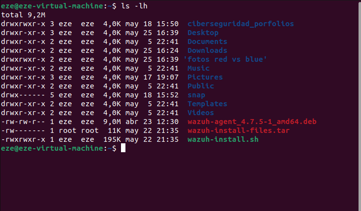
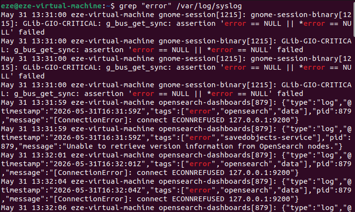
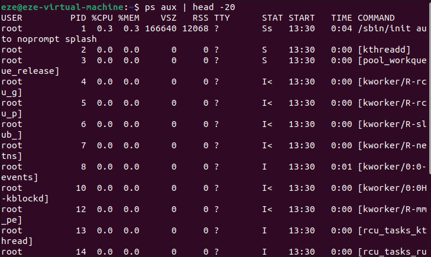

## 📖 Contenido

### Nivel Básico
1-10. Comandos básicos (navegación, archivos)

**Ejemplo de ejecución:**

### Nivel Intermedio
11-20. Comandos intermedios (búsqueda, permisos, procesos)

**Ejemplo de ejecución:**

### Nivel Avanzado
21-30. Comandos avanzados (red, editores, compresión)

**Ejemplo de ejecución:**

