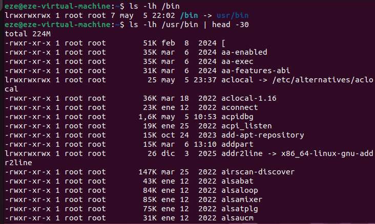
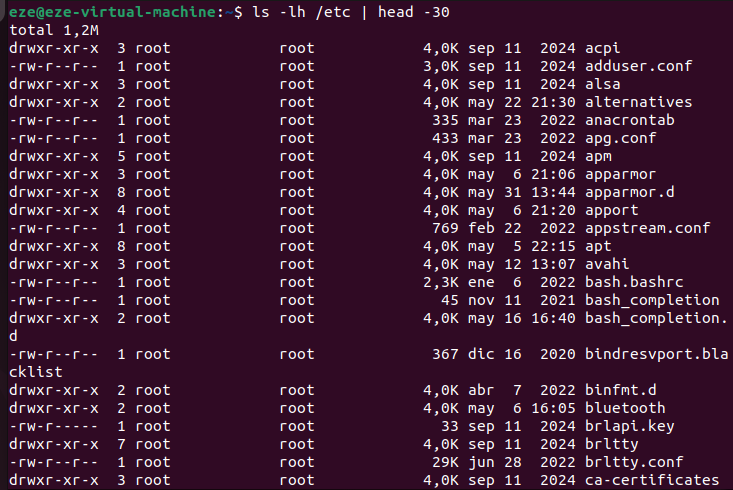
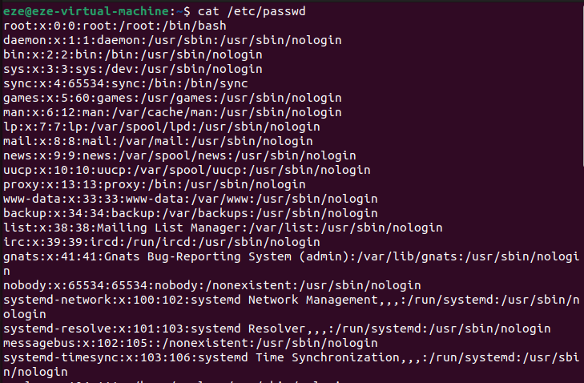
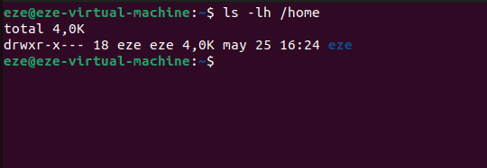
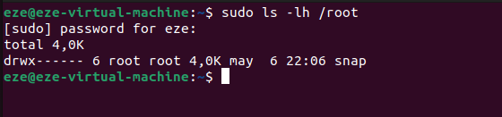
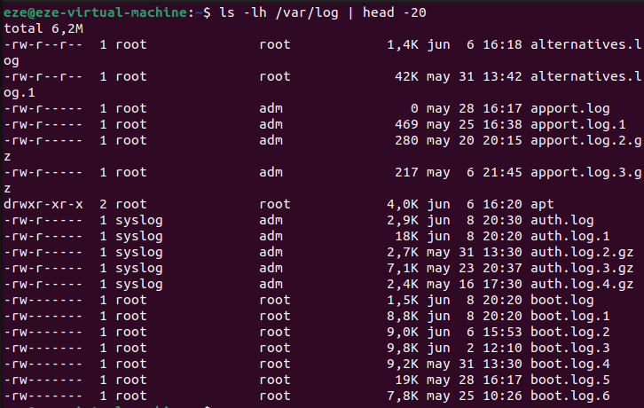
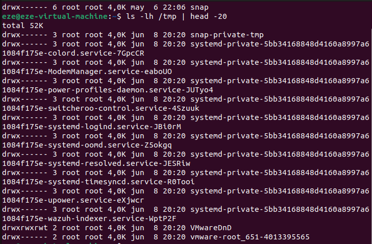

# Guía Completa: Estructura de Directorios de Linux

## INTRODUCCIÓN

Linux organiza archivos en directorios. Pero no es al azar. Cada carpeta tiene un propósito específico. Entender esto es fundamental en ciberseguridad.

¿Por qué? Porque cuando investigas un incidente, necesitas saber dónde buscar. Cuando hardeneás un sistema, necesitas saber qué proteger. Cuando pentesteas, necesitas saber qué explorar.

Los directorios de Linux cuentan historias. Solo necesitas saber dónde buscar.

## /BIN - COMANDOS ESENCIALES

**Qué es:** Binarios (programas) esenciales del sistema.

**Nota importante:** En sistemas modernos, `/bin` es un enlace simbólico (link) a `/usr/bin`. Así que en realidad estamos viendo `/usr/bin`.

**Qué contiene:** Comandos que usas diariamente: `ls`, `cat`, `grep`, `cp`, `mv`, `rm`, etc.

**Por qué importa en seguridad:** Aquí están los comandos críticos del sistema. Si alguien los modifica, puede comprometer todo. Los atacantes a veces reemplazan comandos con versiones maliciosas (rootkits).

**Cómo explorarlo:**
```bash
ls -lh /usr/bin | head -30
```



Verás algo como:
```
-rwxr-xr-x 1 root root 1.2M /usr/bin/cat
-rwxr-xr-x 1 root root 2.1M /usr/bin/grep
-rwxr-xr-x 1 root root 900K /usr/bin/sed
```

**Ejercicio:** Verifica que los comandos críticos no fueron modificados. Compara fechas de modificación. ¿Algo se ve sospechoso?

---

## /ETC - CONFIGURACIONES DEL SISTEMA

**Qué es:** Archivos de configuración del sistema y aplicaciones.

**Qué contiene:** Contraseñas de usuarios (password hashes), configuración de servicios, permisos, SSH config, etc.

**Por qué importa en seguridad:** Este es probablemente el directorio MÁS importante. Aquí están los secretos del sistema. Los atacantes buscan aquí para entender cómo está configurado todo.

**Cómo explorarlo:**
```bash
ls -lh /etc | head -30
```



Verás carpetas como:
```
drwxr-xr-x  3 root root   ssh/       (Configuración SSH)
drwxr-xr-x  2 root root   sudoers/   (Quién puede usar sudo)
-rw-r--r--  1 root root   passwd     (Lista de usuarios)
-rw-------  1 root root   shadow     (Contraseñas encriptadas)
-rw-r--r--  1 root root   hosts      (Mapeo de IPs a hostnames)
```

**Archivos críticos:**

`/etc/passwd` - Lista de usuarios del sistema. Cada línea es un usuario.
```bash
cat /etc/passwd
```



Verás:
```
root:x:0:0:root:/root:/bin/bash
www-data:x:33:33:www-data:/var/www:/usr/sbin/nologin
eze:x:1000:1000:eze:/home/eze:/bin/bash
```

Desglose: usuario:password(x=en shadow):UID:GID:descripción:home:shell

`/etc/shadow` - Contraseñas encriptadas (solo root puede verlo).
```bash
sudo cat /etc/shadow
```

`/etc/sudoers` - Quién puede ejecutar comandos como root. CRÍTICO.

`/etc/ssh/sshd_config` - Configuración de acceso remoto SSH.

**Por qué importa:**
- En `/etc/passwd` ves qué usuarios existen
- En `/etc/shadow` ves si las contraseñas son débiles
- En `/etc/sudoers` ves quién tiene acceso administrativo
- En `/etc/ssh/sshd_config` ves si SSH está bien configurado

**Ejercicio:** ¿Hay usuarios sospechosos en `/etc/passwd`? ¿Alguien con UID 0 además de root? ¿Hay cuentas de servicio que no deberían estar?

---

## /HOME - DIRECTORIOS DE USUARIOS

**Qué es:** Carpetas personales de cada usuario del sistema.

**Qué contiene:** Archivos, documentos, configuraciones personales, historiales.

**Por qué importa en seguridad:** Aquí es donde los usuarios guardan cosas. Si investigas una compromiso, buscarías aquí. Qué archivos descargó. Qué scripts ejecutó. Qué navegó.

**Cómo explorarlo:**
```bash
ls -lh /home
```



Cada usuario tiene su carpeta.

**Archivos importantes en home:**

`.ssh/` - Claves SSH privadas. CRÍTICO. Si alguien accede aquí, accede a servidores remotos.

`.bash_history` - Historiales de comandos ejecutados. Evidencia forense valiosa.

`.config/` - Configuraciones de aplicaciones.

**.bashrc, .bash_profile** - Scripts que se ejecutan cada vez que abre terminal.

**Por qué importa:**
- En `.bash_history` ves qué comandos ejecutó un usuario
- En `.ssh/` ves si hay claves privadas comprometidas
- En `.bashrc` ves si alguien inyectó malware que se ejecuta automáticamente

**Ejercicio:** ¿Hay `.bash_history` sospechosos? ¿Alguien ejecutando comandos raros? ¿Hay claves SSH en lugares donde no deberían estar?

---

## /ROOT - HOME DEL ADMINISTRADOR

**Qué es:** Carpeta personal del usuario root (administrador).

**Qué contiene:** Configuraciones y archivos del administrador.

**Por qué importa en seguridad:** Si alguien accede a /root, tiene acceso administrativo total. Es el objetivo final.

**Cómo explorarlo:**
```bash
ls -lh /root
```



**Por qué importa:**
- Claves SSH del root
- Historiales de comandos administrativos
- Scripts que se ejecutan con privilegios

---

## /VAR/LOG - LOGS DEL SISTEMA

**Qué es:** Logs (registros) de todo lo que pasó en el sistema.

**Qué contiene:** Eventos del sistema, intentos de login, errores de servicios, etc.

**Por qué importa en seguridad:** Los logs son LA EVIDENCIA. Si alguien atacó, hay un log. Si un servicio se colgó, hay un log. Los logs cuentan la historia completa.

**Cómo explorarlo:**
```bash
ls -lh /var/log | head -20
```



**Archivos críticos:**

`/var/log/auth.log` - Intentos de login (exitosos y fallidos).
```bash
tail -20 /var/log/auth.log
```

`/var/log/syslog` - Eventos generales del sistema.

`/var/log/fail2ban.log` - IPs bloqueadas por intentos fallidos.

**Por qué importa:**
- En `auth.log` ves intentos de acceso
- En `syslog` ves qué servicios se iniciaron/pararon
- En `fail2ban.log` ves ataques detectados

**Ejercicio:** ¿Hay intentos fallidos de login? ¿De qué IPs? ¿A qué horas? ¿Hay un patrón de ataque?

---

## /TMP - ARCHIVOS TEMPORALES

**Qué es:** Carpeta para archivos temporales.

**Qué contiene:** Cualquier cosa. Scripts, exploits, datos temporales.

**Por qué importa en seguridad:** Los atacantes usan /tmp para esconder malware. Es una carpeta donde pueden escribir sin ser notados (a veces). Investigadores buscan aquí para encontrar evidencia de ataques.

**Cómo explorarlo:**
```bash
ls -lh /tmp | head -20
```



**Por qué importa:**
- Malware descargado
- Scripts de ataque
- Evidencia de exploit

**Ejercicio:** ¿Hay archivos sospechosos? ¿Archivos ejecutables en /tmp? ¿Scripts con nombres raros?

---

## RESUMEN - DÓNDE BUSCAR SEGÚN TU OBJETIVO

**¿Investigas un incidente?**
- `/var/log/auth.log` - ¿Cuándo entraron?
- `/var/log/syslog` - ¿Qué pasó después?
- `/home/usuario/.bash_history` - ¿Qué comandos ejecutó?
- `/tmp` - ¿Qué descargó?

**¿Hardeneás un sistema?**
- `/etc/passwd` - ¿Hay usuarios innecesarios?
- `/etc/sudoers` - ¿Quién tiene acceso administrativo?
- `/etc/ssh/sshd_config` - ¿SSH está bien configurado?
- `/bin` y `/usr/bin` - ¿Alguien modificó comandos?

**¿Pentesteas?**
- `/etc/passwd` - Usuarios para atacar
- `/home/usuario/.ssh/` - Claves para piratear otros servidores
- `/var/log` - Cómo ocultar tus huellas
- `/tmp` - Dónde poner tu malware

**¿Eres administrador?**
- `/var/log` - Monitorear qué pasó
- `/etc/` - Configurar seguridad
- `/home` - Gestionar usuarios
- `/root` - Proteger credenciales administrativas

---

## COMANDOS ÚTILES

Ver todos los directorios:
```bash
ls -lh /
```

Ver tamaño de directorios:
```bash
du -sh /home /var /etc
```

Buscar archivos modificados recientemente:
```bash
find /home -mtime -7
```

Buscar archivos ejecutables en /tmp (sospechoso):
```bash
find /tmp -type f -executable
```

Ver diferencias entre directorios (para detectar modificaciones):
```bash
ls -la /usr/bin > /tmp/bins_original.txt
ls -la /usr/bin > /tmp/bins_actual.txt
diff /tmp/bins_original.txt /tmp/bins_actual.txt
```

---

## EJERCICIOS PRÁCTICOS

**Ejercicio 1:** Cuenta cuántos usuarios tiene el sistema.
```bash
wc -l /etc/passwd
```

**Ejercicio 2:** ¿Hay usuarios sin contraseña (campo x vacío)?
```bash
awk -F: '$2=="" {print $1}' /etc/shadow
```

**Ejercicio 3:** ¿Quién puede ejecutar sudo?
```bash
cat /etc/sudoers
```

**Ejercicio 4:** Busca archivos en /tmp más nuevos que hace 1 hora.
```bash
find /tmp -type f -mmin -60
```

**Ejercicio 5:** ¿Hay intentos fallidos de login en las últimas 24 horas?
```bash
grep "Failed password" /var/log/auth.log | wc -l
```

---

## NOTAS FINALES

- Los directorios de Linux no son al azar. Cada uno existe por una razón.
- En ciberseguridad, saber dónde buscar es la mitad de la batalla.
- Los permisos importan. Algunos directorios solo root puede ver.
- Los logs son tu mejor amigo. Guardan toda la historia.
- En un incidente, estos directorios son la escena del crimen.

---

Autor: Ezequiel Ayre
LinkedIn: www.linkedin.com/in/ezequiel-ayre-6b753715b
