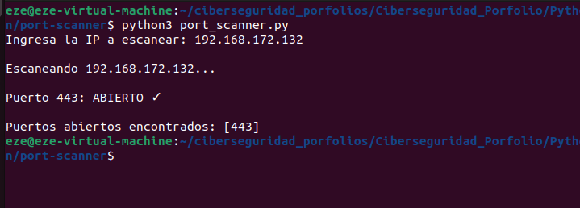

# Port Scanner - Escáner de Puertos en Python

Herramienta educativa que escanea puertos TCP en una máquina remota para identificar servicios activos.

## 🎯 ¿Qué hace?

El script intenta conectarse a cada puerto (1 a 1000) en la IP que especifiques.

Si el puerto responde = **PUERTO ABIERTO**
Si no responde en 1 segundo = **PUERTO CERRADO**

Muestra un resumen final con todos los puertos abiertos encontrados.

---

## 📋 Requisitos

- Python 3.x
- Librería `socket` (viene incluida en Python)
- Conexión a la red

---

## 🚀 Cómo usar

**Ejecutar el script:**

```bash
python3 port_scanner.py
```

**Ingresar IP:**

El script preguntará:
```
Ingresa la IP a escanear: 
```

Escribe la IP (ejemplo: `192.168.172.132`) y presiona Enter.

**Output:**

```
Escaneando 192.168.172.132...

Puerto 22: ABIERTO ✓
Puerto 80: ABIERTO ✓
Puerto 443: ABIERTO ✓

Puertos abiertos encontrados: [22, 80, 443]
```

---

## 💻 Explicación del Código

### Imports

```python
import socket
```
Importa la librería `socket` que permite conectarse a puertos de red.

### Entrada del usuario

```python
ip = input("Ingresa la IP a escanear: ")
```
Pide al usuario que ingrese una IP y la guarda en la variable `ip`.

### Inicializar lista

```python
puertos_abiertos = []
```
Crea una lista vacía para guardar los puertos que encuentre abiertos.

### Loop de escaneo

```python
for puerto in range(1, 1001):
```
Repite 1000 veces, probando cada puerto desde el 1 hasta el 1000.

### Crear conexión

```python
conexion = socket.socket()
conexion.settimeout(1)
```
Crea una conexión de red y establece que espere máximo 1 segundo por respuesta.

### Intentar conectar

```python
resultado = conexion.connect_ex((ip, puerto))
```
Intenta conectarse a la IP y puerto especificados.
- Devuelve `0` si **ABIERTO**
- Devuelve otro número si **CERRADO**

### Verificar resultado

```python
if resultado == 0:
    print(f"Puerto {puerto}: ABIERTO ✓")
    puertos_abiertos.append(puerto)
```
Si el resultado es 0 (puerto abierto):
- Imprime que está abierto
- Agrega el número a la lista `puertos_abiertos`

### Cerrar conexión

```python
conexion.close()
```
Cierra la conexión para liberar recursos.

### Manejo de errores

```python
except:
    pass
```
Si algo falla, continúa con el siguiente puerto sin interrumpir.

### Resultado final

```python
print(f"\nPuertos abiertos encontrados: {puertos_abiertos}")
```
Muestra la lista final de puertos abiertos.

---

## 🔍 Ejecución Real



**Resultado:**
- Se escaneó la IP 192.168.172.132
- Se encontró **1 puerto abierto: puerto 443**
- Puerto 443 = HTTPS (Wazuh Dashboard)

---

## 🛠️ Conceptos Aprendidos

✅ Librería `socket` para networking  
✅ Loops `for` y `range()`  
✅ Condicionales `if`  
✅ Listas y método `append()`  
✅ Try/except para manejo de errores  
✅ Variables y entrada de usuario  
✅ F-strings para formatear texto  
✅ Conexiones TCP  

---

## 🎓 Mejoras Posibles

1. Agregar argumentos de línea de comandos (IP como parámetro)
2. Mostrar nombre del servicio para cada puerto abierto
3. Agregar barra de progreso
4. Escanear rango personalizado de puertos
5. Exportar resultados a archivo
6. Agregar escaneo UDP además de TCP

---

## ⚠️ Nota Legal

Este script es solo para uso educativo en redes que controles.

No uses para escanear redes sin autorización (es ilegal).

---

## 📚 Autor

Ezequiel Ayre

LinkedIn: [www.linkedin.com/in/ezequiel-ayre-6b753715b](https://www.linkedin.com/in/ezequiel-ayre-6b753715b)

GitHub: [github.com/Ezeayre](https://github.com/Ezeayre)
