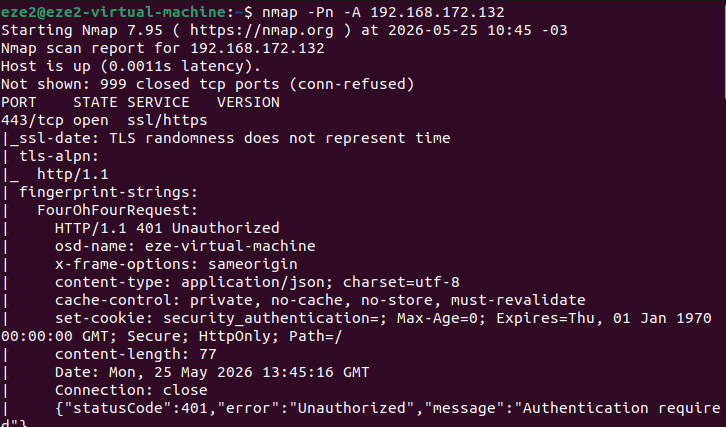
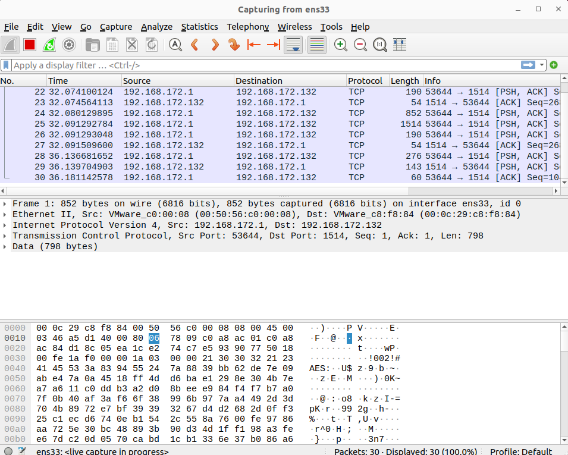
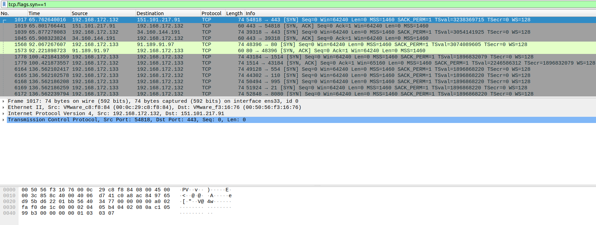
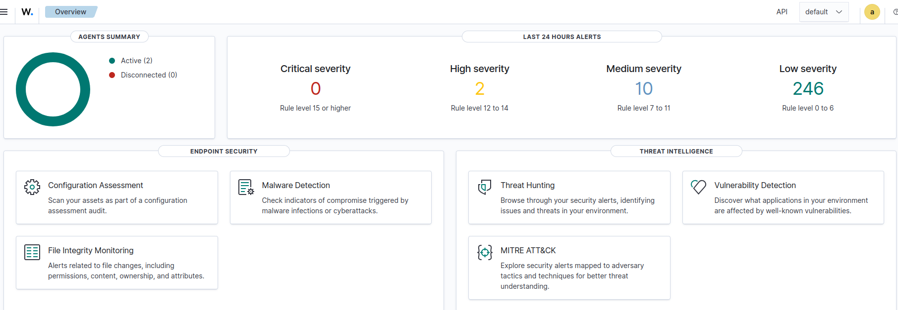
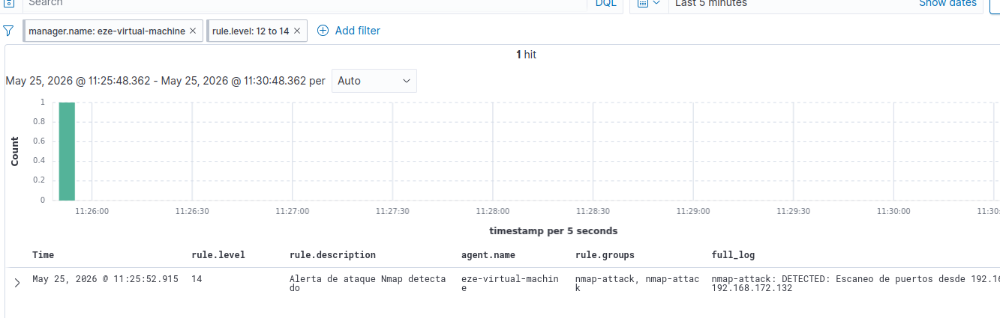
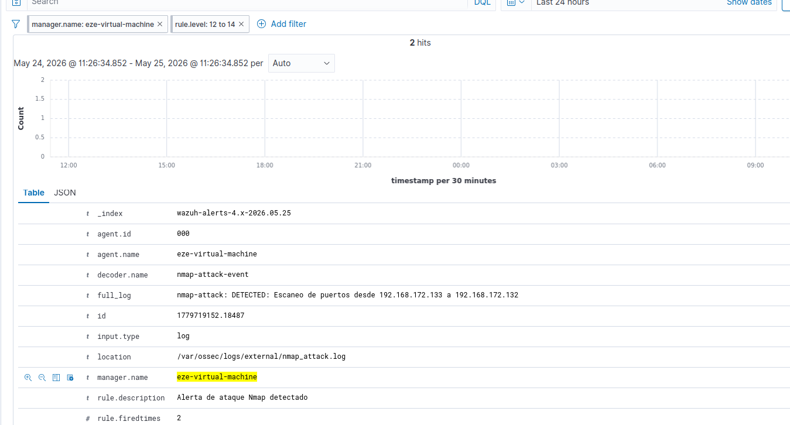

# Red Team vs Blue Team - Detección de Ataques con Wazuh y Wireshark

Proyecto de ciberseguridad que demuestra cómo un equipo Blue Team (defensa) detecta y responde a ataques de un Red Team (ataque) usando Wazuh como SIEM y Wireshark para captura de tráfico.

## 🎯 ¿Qué hicimos?

1. **Red Team (atacante)** ejecuta un escaneo de puertos con nmap
2. **Blue Team (defensor)** captura el tráfico con Wireshark
3. **Wazuh** analiza y detecta el ataque simulado
4. **Documentamos** cómo ambas herramientas trabajan juntas

---

## 🏗️ Arquitectura

- **Red Team:** Ubuntu 192.168.172.133 (máquina atacante)
- **Blue Team:** Ubuntu 192.168.172.132 (servidor con Wazuh, SIEM)
- **Wazuh Manager:** Corriendo en Blue Team
- **Wazuh Agent:** En Red Team (para reportar actividad)

---

## 📋 Flujo del Ataque y Detección

### Fase 1: Red Team Ataca



Red Team ejecuta:
```bash
nmap -A 192.168.172.132
```

Este comando escanea todos los puertos abiertos en Blue Team.

### Fase 2: Blue Team Captura el Tráfico



Blue Team corre Wireshark en interfaz ens33 para capturar todo el tráfico de red en tiempo real.

### Fase 3: Análisis de Paquetes con Wireshark



Wireshark filtra los paquetes SYN (`tcp.flags.syn==1`) para mostrar solo los intentos de conexión del escaneo nmap:
- Múltiples paquetes SYN
- Dirigidos a diferentes puertos
- Origen: Red Team (192.168.172.133)
- Destino: Blue Team (192.168.172.132)

### Fase 4: Simulación del Ataque en Wazuh

**Nota importante:** Para esta demostración, simulamos el ataque configurando decoders y rules personalizadas en Wazuh, además de capturar el tráfico real con Wireshark. Esto nos permitió mostrar cómo Wazuh detectaría un ataque en un escenario real.

**Pasos de configuración:**

1. Creamos archivo de logs externo: `/var/ossec/logs/external/nmap_attack.log`
2. Declaramos el archivo en `ossec.conf`
3. Creamos decoder personalizado `nmap-attack-event` que busca el patrón: `nmap-attack: DETECTED:`
4. Creamos regla personalizada con ID 100003 y level 14 (crítico)
5. Escribimos log simulado: `nmap-attack: DETECTED: Escaneo de puertos desde 192.168.172.133 a 192.168.172.1`

### Fase 5: Panel de Wazuh Detectando



El dashboard principal de Wazuh muestra el estado del sistema y los agents conectados.

### Fase 6: Alerta Crítica Generada



Wazuh genera una alerta de **nivel 14 (CRÍTICO)** con:
- **Decoder:** nmap-attack-event
- **Regla ID:** 100003
- **Descripción:** Alerta de ataque Nmap detectado
- **Timestamp:** Detectado en tiempo real

### Fase 7: Detalles Completos del Evento



Los detalles muestran:
- **Agent ID:** 000 (sistema local)
- **Full Log:** El mensaje exacto del ataque simulado
- **Decoder Name:** nmap-attack-event
- **Rule Groups:** nmap-attack
- **Alert by Email:** Habilitado (envía notificación)

---

## 🔧 Herramientas Utilizadas

### Wireshark
- **Función:** Captura y análisis de tráfico de red
- **Versión:** 4.x
- **Uso:** Mostrar paquetes SYN del escaneo nmap en tiempo real

### Wazuh
- **Función:** SIEM (Security Information and Event Management)
- **Versión:** 4.14.5
- **Componentes:**
  - Manager: Procesa eventos y genera alertas
  - Indexer: Almacena datos
  - Dashboard: Interfaz de visualización
  - Agent: Reporta actividad en Red Team

### Nmap
- **Función:** Escaneador de puertos
- **Comando:** `nmap -A [IP]`
- **Uso:** Simular ataque real desde Red Team

---

## 📊 Lo Que Demuestra Este Proyecto

✅ Comprensión de arquitectura Red Team vs Blue Team 
✅ Captura y análisis de tráfico de red 
✅ Configuración de SIEM (Wazuh) 
✅ Creación de decoders y reglas personalizadas 
✅ Detección de ataques en tiempo real 
✅ Integración de múltiples herramientas forenses 
✅ Respuesta a incidentes coordinada 

---

## 🛡️ Implicaciones de Seguridad

Este proyecto demuestra:

1. **La importancia del monitoreo:** Sin Wazuh, el ataque pasaría desapercibido
2. **Análisis de tráfico:** Wireshark muestra qué está pasando en la red
3. **Automatización:** Wazuh automatiza la detección sin intervención manual
4. **Respuesta rápida:** Las alertas críticas permiten reaccionar inmediatamente

**En un escenario real:**
- El SOC (Security Operations Center) recibiría la alerta por email
- Los analistas investigarían el origen del ataque
- Se bloquearía la IP atacante con firewall
- Se registraría el incidente para auditoría

---

## 🎓 Lo Que Aprendí

Con este proyecto practiqué:

✅ Configuración de SIEM profesional (Wazuh) 
✅ Análisis forense de tráfico de red 
✅ Creación de decoders y reglas personalizadas 
✅ Arquitectura de defensa en capas 
✅ Simulación de ataques realistas 
✅ Respuesta a incidentes coordinada 
✅ Uso de herramientas estándar de la industria 

---

## 📚 Autor

Ezequiel Ayre

LinkedIn: [www.linkedin.com/in/ezequiel-ayre-6b753715b](https://www.linkedin.com/in/ezequiel-ayre-6b753715b)

GitHub: [github.com/Ezeayre](https://github.com/Ezeayre)
