# Decoders y Rules en Wazuh

Proyecto de ciberseguridad que documenta qué son los decoders y las rules en Wazuh (SIEM), cómo se relacionan con los logs, y cómo se usan para enseñarle a Wazuh a reconocer y alertar sobre un evento que no detecta de forma nativa. Como ejemplo práctico, se muestra el caso de un escaneo de puertos con Nmap.

Este proyecto se conecta con el proyecto [Red Team vs Blue Team](https://ezeayre.github.io/Ciberseguridad_Porfolio/RedTeam-vs-BlueTeam/index.html), donde se simuló ese ataque, y explica en detalle la configuración que hizo posible detectarlo.

---

## 🎯 ¿Qué vas a encontrar en esta guía?

1. Qué es un decoder y qué función cumple
2. Qué es una rule y qué función cumple
3. Cómo se relacionan los decoders, las rules y los logs entre sí
4. Un ejemplo práctico completo: usar ambos para detectar un escaneo de Nmap
5. El resultado final: la alerta generada en el Dashboard

---

## 🔍 ¿Qué es un Decoder?

Un decoder es la pieza de configuración que le enseña a Wazuh a **interpretar el contenido de un log**. Wazuh recibe constantemente líneas de texto plano desde distintas fuentes (sistema operativo, aplicaciones, archivos personalizados), y por sí solo no sabe qué significan ni qué partes son relevantes.

El decoder define un patrón (usando expresiones regulares) que busca en esa línea de texto, y separa la información en campos que Wazuh sí puede entender y usar después: quién generó el evento, qué mensaje trae, desde dónde vino, etc.

En resumen: **sin decoder, un log es solo texto sin estructura para Wazuh.** Con decoder, ese mismo texto se transforma en datos organizados y consultables.

En el Dashboard de Wazuh, los decoders se gestionan desde:

**Management → Decoders**

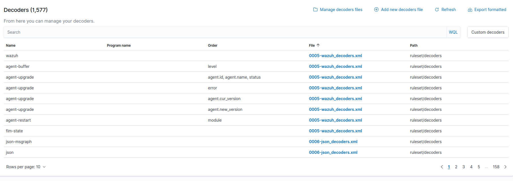

---

## ⚖️ ¿Qué es una Rule?

Una rule es la pieza de configuración que le dice a Wazuh **qué hacer cuando un log, ya interpretado por un decoder, cumple determinada condición**. Es la capa que convierte "un dato que Wazuh entendió" en "una alerta que un analista puede ver y actuar".

Cada rule define, entre otras cosas: qué patrón o decoder debe coincidir, qué nivel de gravedad (level) asignarle al evento (de 0 a 16, siendo 16 el más crítico), y a qué grupo pertenece (por ejemplo: autenticación, malware, escaneo de red).

En resumen: **el decoder entiende el log, la rule decide si eso amerita una alerta y de qué gravedad.**

En el Dashboard, las rules se gestionan desde:

**Management → Rules**

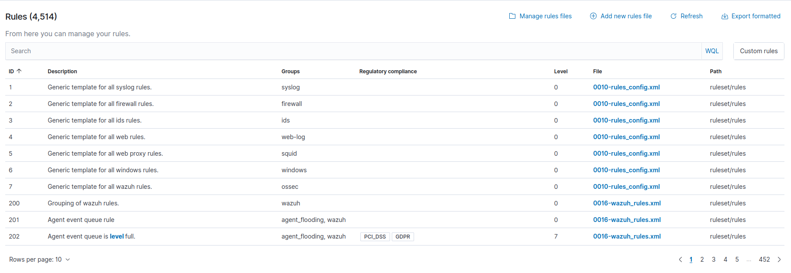

---

## 🔗 Cómo se relacionan Decoders, Rules y Logs

El flujo siempre sigue el mismo orden:

```
Log (texto plano) → Decoder (lo interpreta) → Rule (evalúa y decide) → Alerta (si corresponde)
```

Sin log, no hay nada que procesar. Sin decoder, el log no se entiende. Sin rule, el log entendido no genera ninguna reacción. Las tres piezas dependen entre sí — Wazuh solo genera una alerta cuando las tres están correctamente conectadas.

---

## 🧪 Ejemplo práctico: detectando un escaneo de Nmap

Wazuh no reconoce un escaneo de puertos por defecto. Para este proyecto se armó un caso concreto que muestra el flujo completo: crear un decoder y una rule desde cero para que Wazuh detecte y alerte sobre un evento que antes ignoraba.

### Paso 1: El archivo de log

Se creó un archivo dedicado para este tipo de evento:

```
/var/ossec/logs/external/nmap_attack.log
```

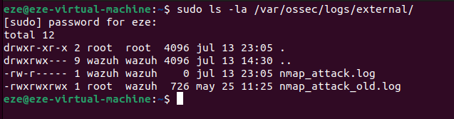

Este archivo se declaró en la configuración de Wazuh (`ossec.conf`), sección `<localfile>`, para que el sistema supiera que debía vigilarlo.

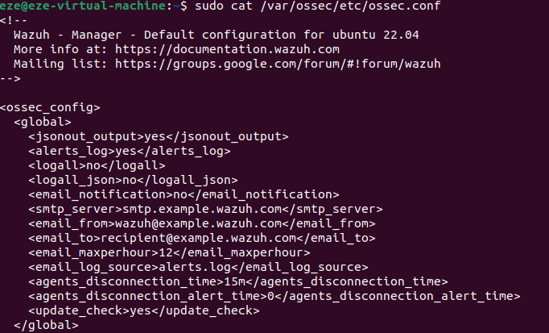

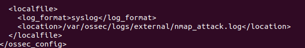

### Paso 2: El decoder personalizado

Se creó un decoder nuevo desde el Dashboard, con este contenido:

```xml
<decoder name="nmap-attack-event">
  <prematch>^nmap-attack: DETECTED:</prematch>
  <regex>^nmap-attack: DETECTED: (.+)$</regex>
  <order>message</order>
</decoder>
```

**¿Qué hace cada parte?**
- `prematch`: busca esa frase exacta al inicio del log, para saber "esto es un evento que me interesa"
- `regex`: extrae el mensaje que viene después de los dos puntos
- `order`: le dice a Wazuh en qué campo guardar esa información extraída

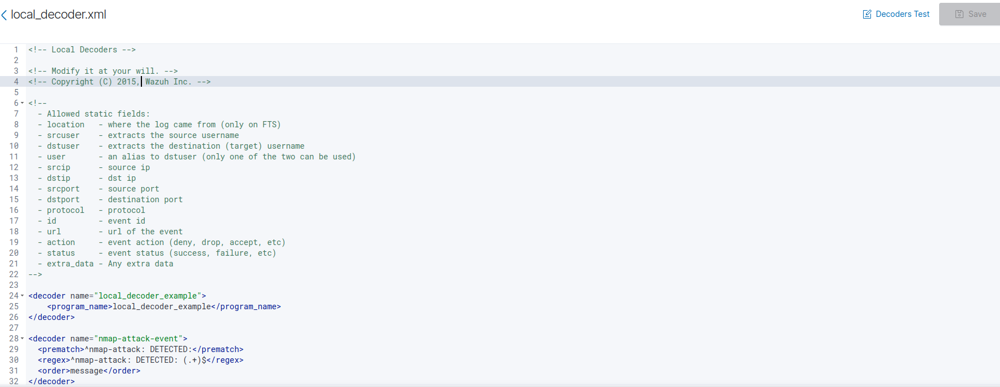

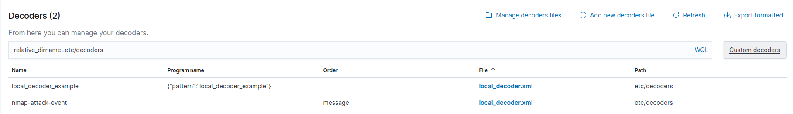

### Paso 3: La rule personalizada

Se creó una rule asociada a ese decoder:

- **ID:** 100003
- **Level:** 14 (crítico)
- **Grupo:** nmap-attack

**¿Por qué level 14?**
Un escaneo de puertos es un indicio claro de reconocimiento previo a un ataque, y merece atención inmediata del equipo de seguridad.

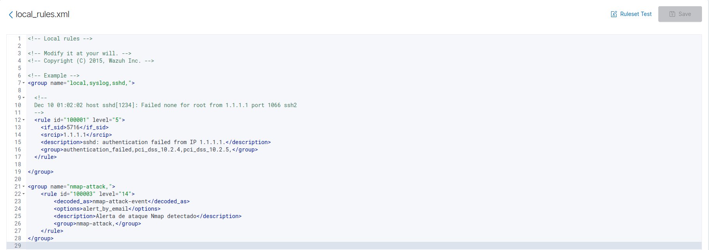

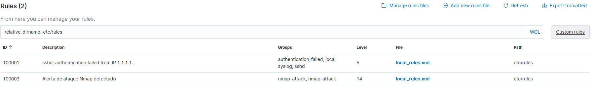

### Paso 4: Disparando el evento (simulación del ataque)

Con el decoder y la rule ya configurados, se simuló el evento escribiendo manualmente una línea en el archivo de log, imitando lo que hubiera generado un escaneo real:

```bash
echo "nmap-attack: DETECTED: Escaneo de puertos desde 192.168.172.133 a 192.168.172.132" | sudo tee -a /var/ossec/logs/external/nmap_attack.log
```

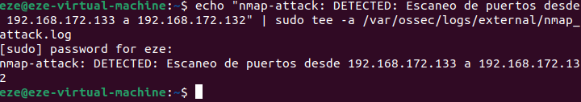

> **Nota:** esta simulación escribe el log manualmente para probar que el decoder y la rule funcionan correctamente, tal como se haría antes de llevar una configuración a producción. No es una detección de tráfico de red en tiempo real — para eso Wazuh necesitaría un IDS de red (como Suricata) integrado.

### Paso 5: El resultado — la alerta generada

Wazuh leyó el log, lo interpretó con el decoder, aplicó la rule correspondiente, y generó la alerta.

En el Dashboard: **Security Events** (o **Threat Hunting**, según versión) → filtrado por `rule.id: 100003`

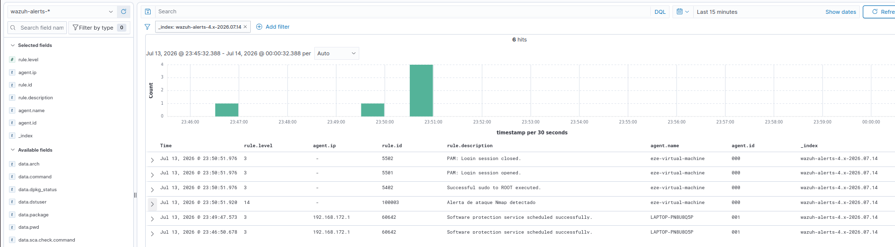

Al hacer click en la alerta, se ve el detalle completo:

- `decoder.name`: nmap-attack-event
- `rule.id`: 100003
- `rule.level`: 14
- `full_log`: el mensaje original completo

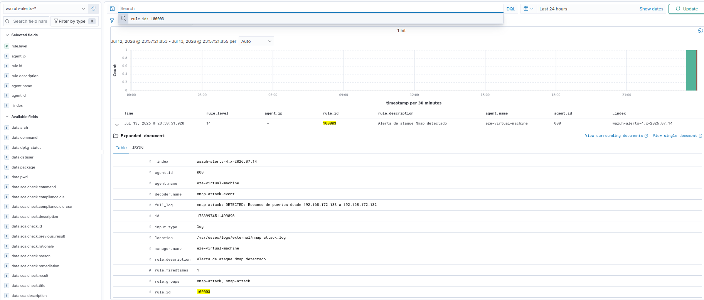

---

## 🔗 Proyectos relacionados

- [Red Team vs Blue Team](https://ezeayre.github.io/Ciberseguridad_Porfolio/RedTeam-vs-BlueTeam/index.html) - El ataque original que motivó esta configuración
- [Wazuh Setup](https://github.com/Ezeayre/Ciberseguridad_Porfolio/tree/main/SIEM/wazuh-setup) - Instalación inicial de Wazuh

---

## 📚 Autor

Ezequiel Ayre

LinkedIn: [www.linkedin.com/in/ezequiel-ayre-6b753715b](https://www.linkedin.com/in/ezequiel-ayre-6b753715b)

GitHub: [github.com/Ezeayre](https://github.com/Ezeayre)
