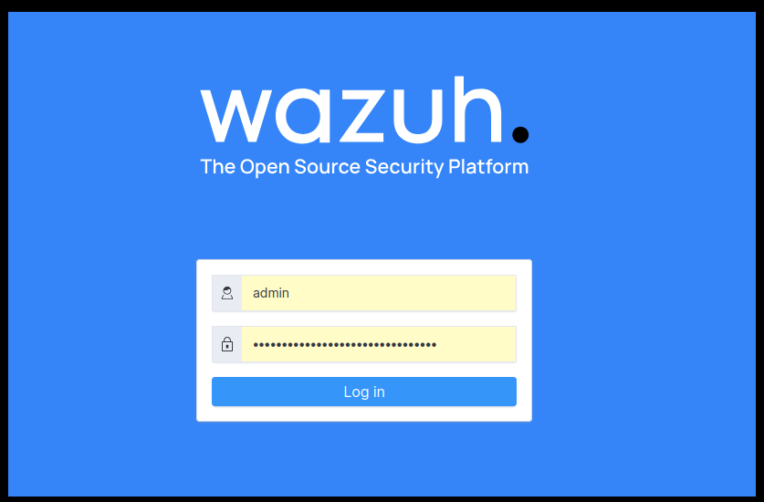
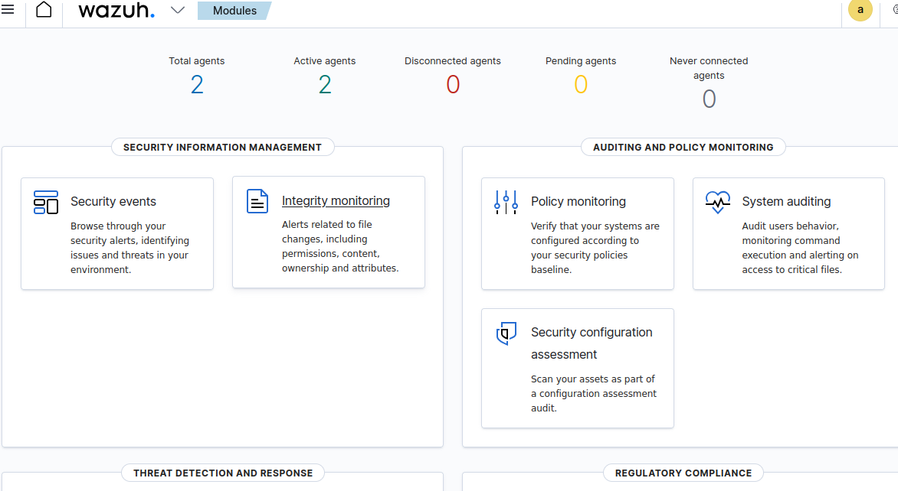
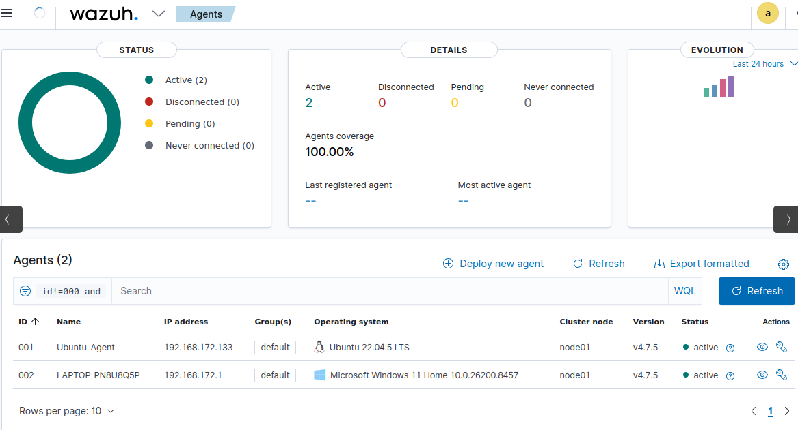
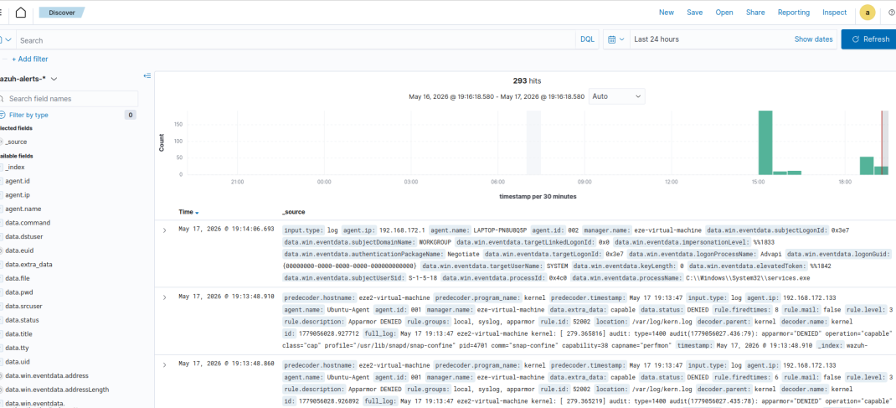
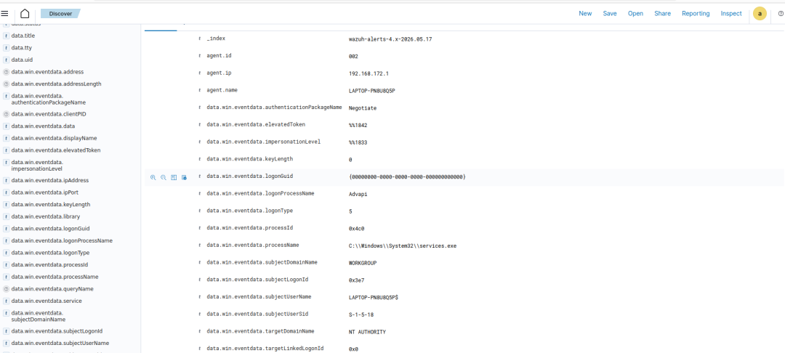

# Wazuh Setup - Documentación e Instalación

Documentación completa de la instalación y configuración de **Wazuh 4.7.5** con 2 agents (Ubuntu y Windows).

## ¿Qué es Wazuh?

Wazuh es una plataforma open-source de **SIEM** (Security Information and Event Management) que:
- Detecta y responde a amenazas de seguridad
- Monitorea integridad de archivos
- Recolecta y analiza logs de sistemas
- Proporciona visibilidad en tiempo real del estado de seguridad

## Componentes instalados

- **Manager (Servidor):** Procesa eventos y genera alertas (Ubuntu 22.04)
- **Agent 001:** Máquina Ubuntu 22.04.5 LTS (192.168.172.133)
- **Agent 002:** Máquina Windows 11 (192.168.172.1)
- **Dashboard:** Interfaz web para visualizar eventos y alertas

## Requisitos

- Ubuntu 22.04 LTS (para el Manager)
- Mínimo 2GB RAM
- 10GB de espacio en disco
- Acceso de root o sudo

## Instalación del Manager

### 1. Actualizar el sistema

```bash
sudo apt update
sudo apt upgrade -y
```

### 2. Instalar Wazuh

Se instala automáticamente desde el repositorio oficial de Wazuh.

```bash
curl -s https://packages.wazuh.com/key/GPG-KEY-WAZUH | apt-key add -
echo "deb https://packages.wazuh.com/4.x/apt/ stable main" > /etc/apt/sources.list.d/wazuh.list
sudo apt update
sudo apt install wazuh-manager -y
```

### 3. Iniciar el servicio

```bash
sudo systemctl start wazuh-manager
sudo systemctl enable wazuh-manager
```

### 4. Verificar que está corriendo

```bash
sudo systemctl status wazuh-manager
```

## Instalación del Dashboard

El Dashboard proporciona la interfaz web para acceder a Wazuh.

```bash
sudo apt install wazuh-dashboard -y
sudo systemctl start wazuh-dashboard
sudo systemctl enable wazuh-dashboard
```

## Acceso al Dashboard

- **URL:** `https://192.168.172.133` (reemplaza con tu IP)
- **Usuario:** admin
- **Contraseña:** La generada durante la instalación





## Instalación de Agents

### Agent en Ubuntu

1. Descargar el agent desde el Manager
2. Instalar con dpkg
3. Registrar el agent en el Manager
4. Iniciar el agent

```bash
sudo apt install wazuh-agent -y
sudo systemctl start wazuh-agent
sudo systemctl enable wazuh-agent
```

### Agent en Windows

1. Descargar el ejecutable desde el Manager
2. Ejecutar el instalador
3. Configurar la IP del Manager
4. Iniciar el servicio

El instalador automáticamente registra el agent y lo conecta al Manager.

## Agents Conectados

Ambos agents están activos y enviando eventos al Manager:

- **Agent 001:** Ubuntu-Agent (192.168.172.133) - Activo
- **Agent 002:** LAPTOP-PN8U8Q5P (192.168.172.1) - Activo
- **Cobertura:** 100%



## Eventos Recolectados

Wazuh recolecta automáticamente:
- Eventos de login (éxitosos y fallidos)
- Cambios en archivos del sistema
- Procesos ejecutados
- Conexiones de red
- Logs de aplicaciones

Total de eventos procesados: **293 eventos en 24 horas**



## Detalles de un Evento

Cada evento contiene información detallada:
- Timestamp exacto
- IP del agent
- Nombre del agent
- Tipo de evento
- Datos específicos del evento



## Características principales

✅ Detección de amenazas en tiempo real  
✅ Monitoreo de integridad de archivos  
✅ Análisis de logs centralizado  
✅ Alertas configurables por severidad  
✅ Dashboard intuitivo y personalizable  
✅ API REST para integración  

## Lo que aprendí

Con este proyecto practiqué:

✅ Instalación y configuración de SIEM  
✅ Arquitectura Manager-Agent  
✅ Recolección de eventos de múltiples sistemas  
✅ Visualización de datos de seguridad  
✅ Monitoreo de máquinas heterogéneas (Linux + Windows)  

## Próximos pasos

- Crear reglas personalizadas de detección
- Configurar alertas por email
- Integrar con herramientas externas
- Análisis de logs más detallado

## Autor

Ezequiel Ayre

LinkedIn: [www.linkedin.com/in/ezequiel-ayre-6b753715b](https://www.linkedin.com/in/ezequiel-ayre-6b753715b)
